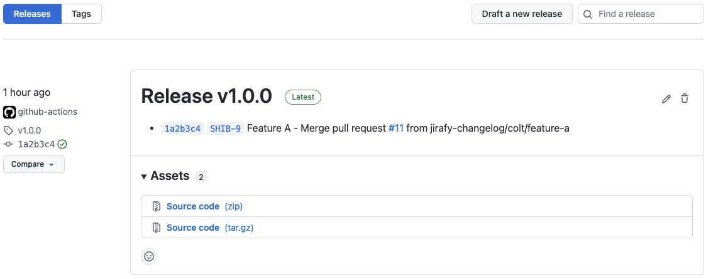

# Jirafy Changelog
This action generates a changelog from two references, where the markdown is formatted for any referenced Jira tickets.

I wanted to include a link to Jira tickets that were linked in Pull Request(s) title.

# Get a changelog between two references
<a href="https://github.com/coltdorsey/jirafy-changelog/releases/tag/v1.0.0"></a>

## Inputs

### `mytoken`

A GITHUB_TOKEN with the ability to pull from the repo in question. This is required.

Why do we need `myToken`? Read more [here](https://help.github.com/en/actions/automating-your-workflow-with-github-actions/authenticating-with-the-github_token#about-the-github_token-secret)

### `head-ref`

The name of the head reference. Default `${{ github.sha }}`.

### `base-ref`

The name of the second branch. Defaults to the `tag_name` of the latest GitHub release. *This must be a GitHub release. Git tags or branches will not work.*

### `jiraHost`

This is your jira domain. (i.e company.atlassian.net)

## Outputs

### `changelog`

Markdown formatted changelog.

## How to use
### Push of tag triggers this action
`git tag -a v#.#.# -m "tag message"`

`git push origin v#.#.#`

### Recommended configuration (paired with github release)

```yaml
name: Jirafy Changelog & Release
on:
  push:
    # Sequence of patterns matched against refs/tags
    tags:
      - 'v*' # Push events to matching v*, i.e. v1.0, v1.0.0

jobs:
  release:
    runs-on: ubuntu-latest
    steps:
      # To use this repository's private action, you must check out the repository
      - name: Checkout
        uses: actions/checkout@v2

      - name: Jirafy Changelog
        id: changelog
        uses: coltdorsey/jirafy-changelog@v1.0.0
        with:
          myToken: ${{ secrets.GITHUB_TOKEN }}
          jiraHost: ${{ secrets.JIRA_HOST }}
          
      - name: Create Release
        id: create_release
        uses: actions/create-release@latest
        env:
          GITHUB_TOKEN: ${{ secrets.GITHUB_TOKEN }}
        with:
          tag_name: ${{ github.ref }}
          release_name: Release ${{ github.ref }}
          body: ${{ steps.changelog.outputs.changelog }}
          draft: false
          prerelease: false
```

### Other use cases

#### First block

If you have two specific references you want:

```yaml
- name: Jirafy Changelog
  id: changelog
  uses: coltdorsey/jirafy-changelog@v1.0.0
  with:
    head-ref: 'v0.0.2'
    base-ref: 'v0.0.1'
    myToken: ${{ secrets.GITHUB_TOKEN }}
    jiraHost: ${{ secrets.JIRA_HOST }}
```

#### Second block

Then you can use the resulting changelog:

```yaml
- name: Get the changelog
  run: |
    cat << "EOF"
    ${{ steps.changelog.outputs.changelog }}
    EOF
```

#### Simple output modifications

Some folks have asked if the action can support changing the output. For example:
  * Reverse order
  * Ignore entries that include this string.
  * Etc.

In order to keep this action as simple as possible we aren't planning to add more flags or options. However since the output is just text you can write a command line to do anything you want. In issue #93 we had a user that wanted to list the changelog in reverse order and drop any entries with `gh-pages`. Here is how they can do that but using Bumping as the restrict word because it shows up in this projects history:

```yaml
      - name: Modify the changelog
        id: modified
        run: |
          set -o noglob
          log=$(cat << "EOF" | grep -v Bumping | tac
          ${{ steps.changelog.outputs.changelog }}
          EOF
          )
          log="${log//'%'/'%25'}"
          log="${log//$'\n'/'%0A'}"
          log="${log//$'\r'/'%0D'}"
          echo "::set-output name=modified::$log"
      - name: Print the modified changelog
        run: |
          cat << "EOF"
          ${{ steps.modified.outputs.modified }}
          EOF
```

You might be wondering about that set of escaping for the `log`. Thats because GitHub Actions doesn't support multiline output. Read more [here](https://github.community/t/set-output-truncates-multiline-strings/16852).

## Example use case

[Generating the jirafied changelog for a GitHub Release.](.github/workflows/release.yml)

## Open Discussions for feature requests or questions

Issues are for folks who are actively using the action and running into an "issue" (bug, missing doc, etc).

Feature requests should be in the [discussion section.](https://github.com/coltdorsey/jirafy-changelog/discussions).
Just to set expectations the bar for a new feature getting added is going to be very high. There is a
cost to adding features in the development and maintainance of the feature. So if you want to jump in and
help develop and maintain lets discuss. If you want to fire off feature ideas, go for it. Just understand its
very likely that without someone willing to take up the task, they won't get implemented.

## Keep up-to-date with GitHub Dependabot

Since [Dependabot](https://docs.github.com/en/github/administering-a-repository/keeping-your-actions-up-to-date-with-github-dependabot)
has [native GitHub Actions support](https://docs.github.com/en/github/administering-a-repository/configuration-options-for-dependency-updates#package-ecosystem),
to enable it on your GitHub repo all you need to do is add the `.github/dependabot.yml` file:

```yaml
version: 2
updates:
  # Maintain dependencies for GitHub Actions
  - package-ecosystem: 'github-actions'
    directory: '/'
    schedule:
      interval: 'daily'
```
## Troubleshooting

### Error not found

```
Error: Not Found
```

If you are seeing this error its likely that you do not yet have a GitHub release. You might have a git tag and that shows up in the release tab. The
API this Action uses only works with GitHub Releases. Convert one of your tags to a release and you'll be on your way. You can check out how this
repository uses this action and GitHub releases for an [example](.github/workflows/release.yml).


## Acknowledgements

I used the changelog-generator framework for this action from: [metcalfc/changelog-generator](https://github.com/metcalfc/changelog-generator). Thanks @metcalfc.
